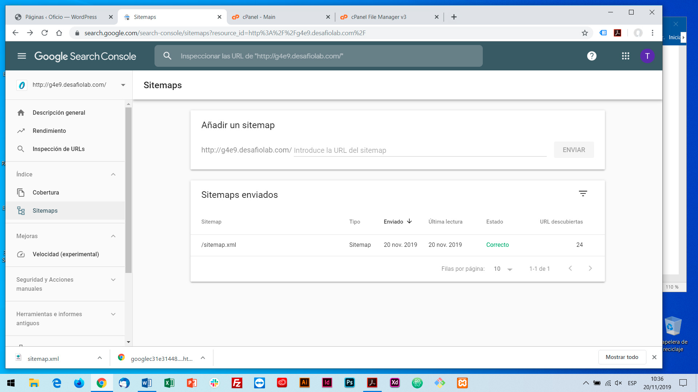

# Desafío - Oficio, Portal de búsqueda de oficios

### URL del sitio: [http://g4e9.desafiolab.com/](http://g4e9.desafiolab.com/)

### Aspectos de seguridad que optimicé:
	- Instalación de última versión de WordPress
	- Utilización de claves robustas
	- Reducción de permisos del archivo wp-config.php de 666 a 600
	- Instalación y configuración de plugin de seguridad Wordfence

### Optimización:
	- Archivo .htaccess con indicaciones para:
		Comprimir archivos de texto.
		Expiración de los headers, cada 1 mes.
		Desactivación ciertas etiquetas.
		Acceso denegado a archivos y directorios ocultos.
		Acceso denegado a los archivos de copia de seguridad y de origen.
		Permitir fuentes de dominio cruzado.
		Autocodificación en codificación UTF-8.
	- Instalación y configuración de plugin Smushit para optimización de imágenes.
	- Instalación y configuración de plugin Auotptimize para optimizar y minificar HTML, JavaScript y CSS.
	- Instalación y configuración de plugin W3 Total Cache para optimizar los temas de caché.

	- Resultado anterior a la optimización:

	

	- Resultado posterior a la optimización:

	![Resultado posterior a la optimización]
	(https://github.com/Tania-Gomez/oficios/blob/master/images/GTmetrix-inicio.jpg)
	
### Resultado posterior a la optimización:

- URL del sitemap: [https://g4e9.desafiolab.com/sitemap.xml](https://g4e9.desafiolab.com/sitemap.xml)

### Integración con Google Search Console:

- URL del sitemap: [https://g4e9.desafiolab.com/sitemap.xml](https://g4e9.desafiolab.com/sitemap.xml)
